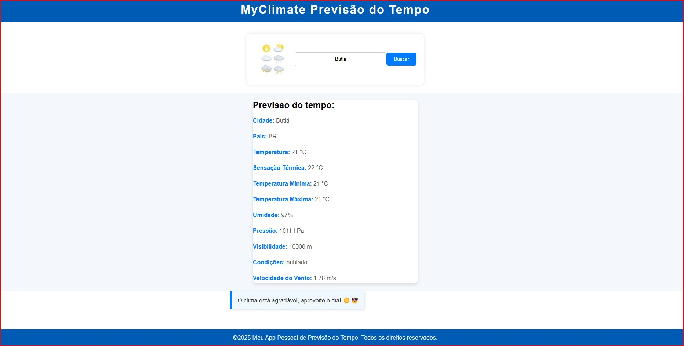

# MyClimate


Este é um projeto de **Previsão do Tempo** desenvolvido em **Angular 16**, que consome uma API externa para exibir informações meteorológicas com base na cidade informada pelo usuário.



## 📌 Funcionalidades
- Input para inserção do nome da cidade.
- Botão para buscar a previsão do tempo.
- Exibição dos dados climáticos da cidade encontrada.
- Mensagem de erro caso a cidade não seja encontrada.
- Exibição de uma mensagem amigável ao final da previsão.

[Demonstração](myClimate/src/assets/climate.gif)

## 🛠️ Tecnologias Utilizadas
- **Angular 16** (Framework front-end)
- **TypeScript** (Linguagem utilizada no Angular)
- **API OpenWeather** (Provedor de dados climáticos)

---

## 📥 Como baixar e rodar o projeto

### 1️⃣ Clone o repositório
```bash
git clone https://github.com/seu-usuario/previsao-tempo-angular.git
cd previsao-tempo-angular
```

### 2️⃣ Instale as dependências
Certifique-se de que possui o **Node.js** instalado. Depois, execute:
```bash
npm install
```

### 3️⃣ Rode o projeto Angular
```bash
ng serve
```
O projeto estará disponível em: `http://localhost:4200`

---

## 🔄 Exemplos de Requisições à API

### Obter a previsão do tempo para uma cidade:
```http
GET https://api.openweathermap.org/data/2.5/weather?q=Butia&appid=SUA_CHAVE&units=metric&lang=pt_br
```

### Exemplo de resposta da API:
```json
{
  "name": "Butiá",
  "sys": { "country": "BR" },
  "main": {
    "temp": 21,
    "feels_like": 22,
    "temp_min": 21,
    "temp_max": 21,
    "humidity": 97,
    "pressure": 1011
  },
  "visibility": 10000,
  "weather": [{ "description": "nublado" }],
  "wind": { "speed": 1.78 }
}
```

### Exemplo de exibição na tela:
```
Previsão do tempo:
Cidade: Butiá
País: BR
Temperatura: 21 °C
Sensação Térmica: 22 °C
Temperatura Mínima: 21 °C
Temperatura Máxima: 21 °C
Umidade: 97%
Pressão: 1011 hPa
Visibilidade: 10000 m
Condições: nublado
Velocidade do Vento: 1.78 m/s

🌤️ Tenha um ótimo dia, faça chuva ou faça sol! 😊
```

Caso a cidade não seja encontrada:
```
Cidade não encontrada. Por favor, verifique o nome digitado e tente novamente.
```

---

## 🎯 Considerações finais
Este projeto foi desenvolvido para demonstrar como consumir uma API externa em Angular e exibir dados de forma dinâmica.
Sinta-se à vontade para melhorá-lo e adaptá-lo conforme suas necessidades!

👨‍💻 Desenvolvido por **Franciele Alves Franco** 🚀

